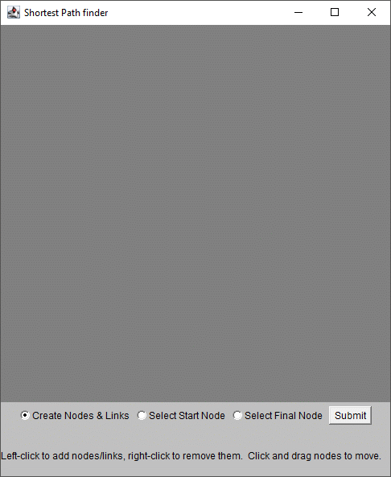
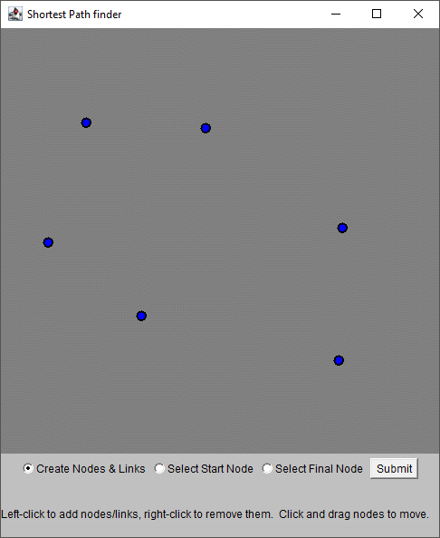
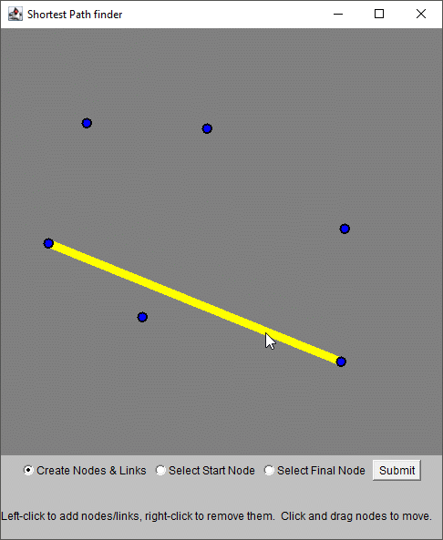
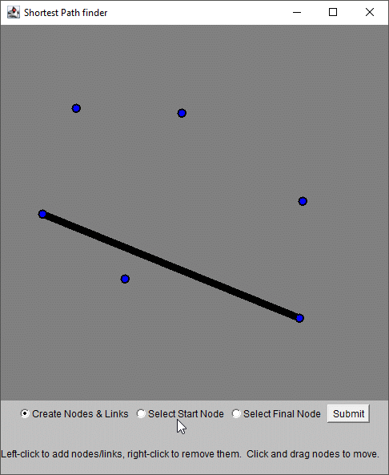
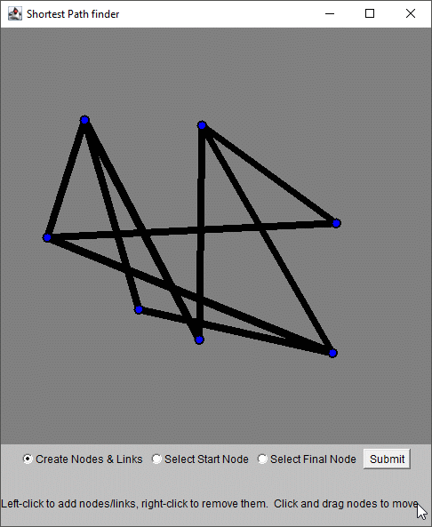
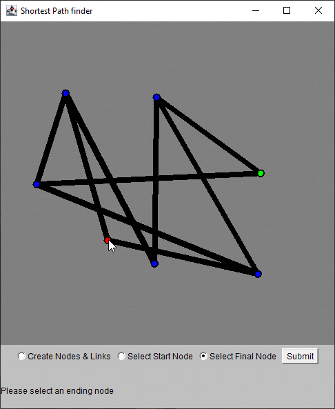
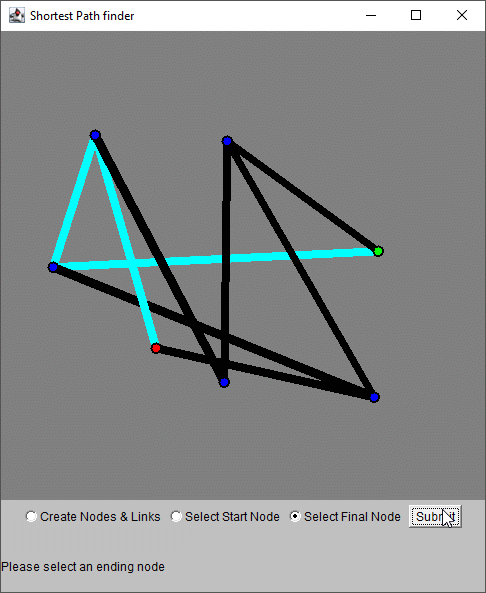

# Shortest Path

This Java program has a graphical user interface made using the AWT library and the `canvas` object.  The user creates a network of nodes (points) and links between nodes.  The user must then designate a starting node and an ending node, and then the program recursively determines the shortest path between the two and highlights it.  The network can be as big as the user can fit into a 500 x 500 pixel canvas.

## User Instructions

Currently there are no binaries published for this program.  Instead, the user must download the code and compile the program themselves in order to use it.  See the **Getting Started** section below.  For these instructions, it is assumed the user has started a compiled version of the program.

Immediately, you will be able to create the nodes in the network simply by clicking on the cavas

After placing a few nodes, you will notice connections between nodes becoming highlighted when you move your mouse over them.

If you click while a highlighted link is visible, you will be adding that link to the network.

After doing this a few times, you will have a network of nodes and links.

Now, you may click the "Select Start Node" radio button, and select a starting node to define your path.

Next, you may click the "Select Final Node" radio button and pick the node where you wish to end the path.

Now that the network is laid out and the beginning and ending nodes are defined, you may click the "Submit" button and the program will find the shortest path betwen the starting and ending points.

## Getting Started

The project may be cloned using this [git link](https://github.com/robbie9485/Shortest-Path.git).  Installation for this program comes from the user compiling the downloaded source code on their machine, whether it be through an IDE like *Eclipse* or manually through the command line.

## High Level Overview

### `Window.java`

This file is where the program begins, at the `public static void main(String args[])` function.  In short, this file sets up all elements of the GUI, such as the radio buttons for different modes, and calls upon the `Display.java` and `Network.java` classes to set up the rest of the program.  It also contains all the necessary listeners for the mode buttons, as well as the submit button.

### `Display.java`

This file is called by `Window.java` to create all the necessary elements for the Java AWT canvas object.  It processes all the user interaction specifically for the canvas object (ex: creating a node when the mouse is clicked on the canvas while in the appropriate mode).  It also houses the `paint` function that is the heart of the GUI.

### `Network.java`

This file compiles instances of the `Node` and `Link` classes together to form a network.  It processes all cases of nodes or links being added or deleted, and it also houses the `shortestPath` function.  This function uses recursion to "walk" through the network, from the specified starting node until one of the conceived paths reaches the final node.  It then chooses the path that took the least amount of "distance" (length of links).  Please see the comments for this function for a more thorough explanation.

### `Node.java`

A fairly simple class that creation of a node, plus any modifications (such as declaring a start and finish node) and any interactions with links that the given node is at the end of.  Finally, it handles it's own graphic rendering (called upon by the `Display` class)

### `Link.java`

This class does exactly the same thing that the `node` class does, except for links instead of nodes.  The main way the `link` class differs from the `node` class is that the `link` class must also handle highlighting (both the mouse-over highlighting and the shortest path highlighting).

## Running tests

There are a few ways to test the program, the most obvious being to follow the instructions above and confirm that the results were what was expected.  However, there are still some more tests that can be performed.

### Example tests

* Creating increasingly complex networks and determining at what point, if at all, the limit of the recursion has been reached, resulting in a frozen program.
* Attempts to "break" the source code by doing things like clicking the "Submit" button prior to establishing start and finish nodes.

## Deployment

There is currently no deployment of this program.  It must be compiled from the source code provided ([see this git link](https://github.com/robbie9485/Shortest-Path.git)).

## Built With

[Eclipse IDE](https://www.eclipse.org/eclipseide/)

## Contributing

Please contact me (robbie9485) on GitHub in order to inquire more about the project.

## Versioning

`Git` functions in Android Studio were used to version the software on *GitHub*

## Authors

Robert Rutherford

## License

This project is licensed under the MIT License - see the [LICENSE.txt](LICENSE.txt) file for details

## Acknowledgments

* Thanks to Alstom for providing the inspiration for this program
* Thanks to Victor Semenov for his guidance
