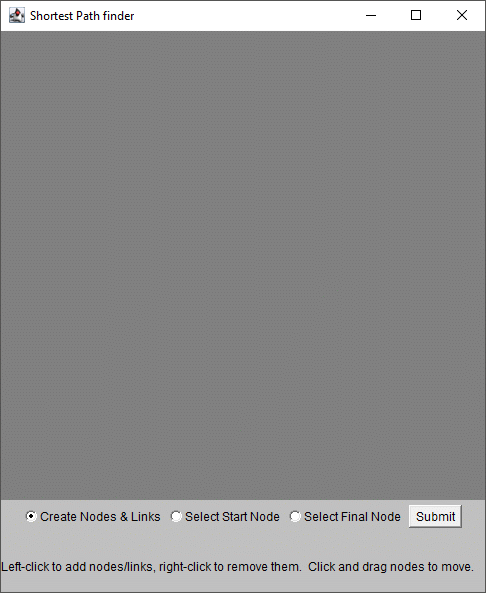
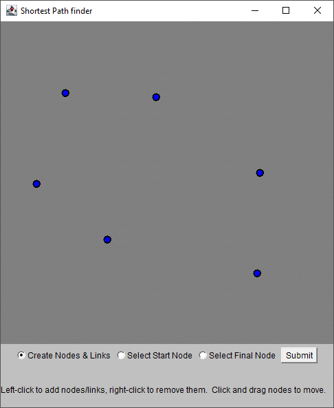
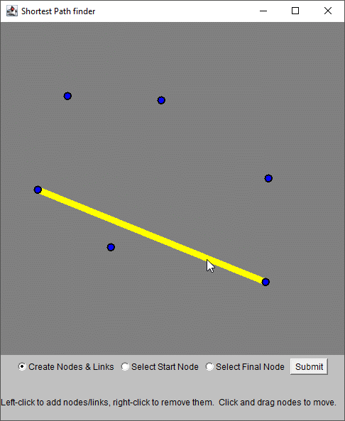
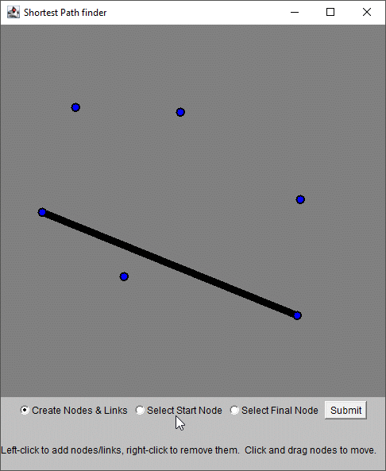
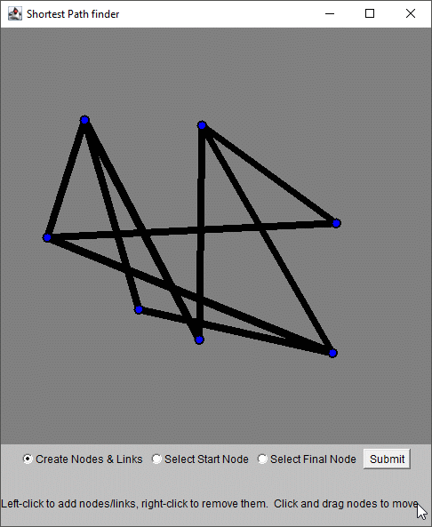
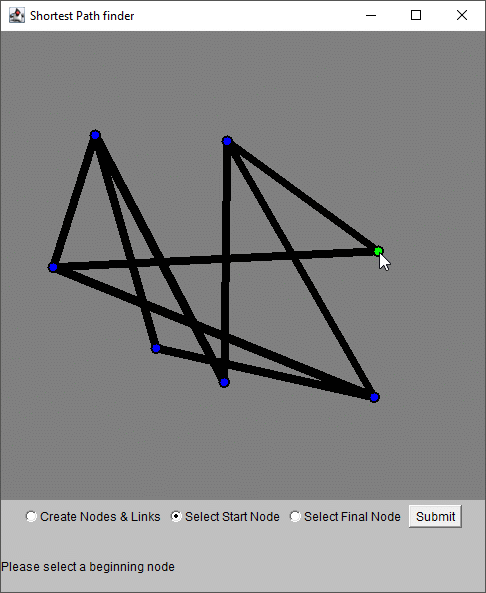
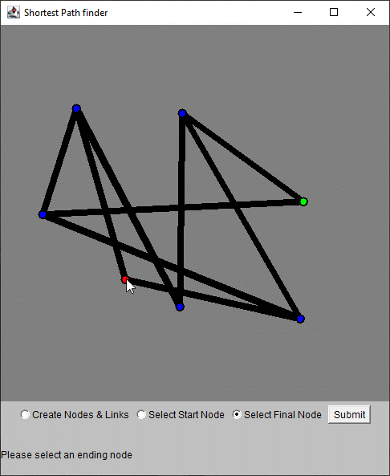
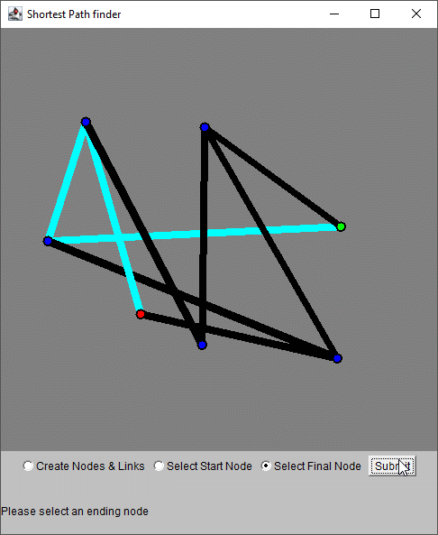

# Shortest Path

This Java program has a graphical user interface made using the AWT library and the `canvas` object.  The user creates a network of nodes (points) and links between nodes.  The user must then designate a starting node and an ending node, and then the program recursively determines the shortest path between the two and highlights it.  The network can be as big as the user can fit into a 500 x 500 pixel canvas.

## Table of Contents

- [Background](#background)
- [Install](#install)
- [Usage](#usage)
- [Contributing](#contributing)
- [License](#license)
- [Acknowledgements](#acknowledgments)

## Background

This app was inspired by a need to find wiring paths through electrical conduit on train cars in the Alstom factory in Hornell, New York.  It does not fulfill that need, but it could fulfill other needs.

## Install

The project may be cloned using this [git link](https://github.com/rbrutherford3/Shortest-Path.git).  Installation for this program comes from the user compiling the downloaded source code on their machine, whether it be through an IDE like *Eclipse* or manually through the command line.

## Usage

Immediately, you will be able to create the nodes in the network simply by clicking on the cavas

After placing a few nodes, you will notice connections between nodes becoming highlighted when you move your mouse over them.

If you click while a highlighted link is visible, you will be adding that link to the network.

After doing this a few times, you will have a network of nodes and links.

Now, you may click the "Select Start Node" radio button, and select a starting node to define your path.

Next, you may click the "Select Final Node" radio button and pick the node where you wish to end the path.

Now that the network is laid out and the beginning and ending nodes are defined, you may click the "Submit" button and the program will find the shortest path betwen the starting and ending points.

## Contributing

Contributions are welcome, including any feedback.  Please contact rbrutherford3 on GitHub.

## License

[MIT © Robert Rutherford](../LICENSE)

## Acknowledgments

* Thanks to Alstom for providing the inspiration for this program
* Thanks to Victor Semenov for his guidance
